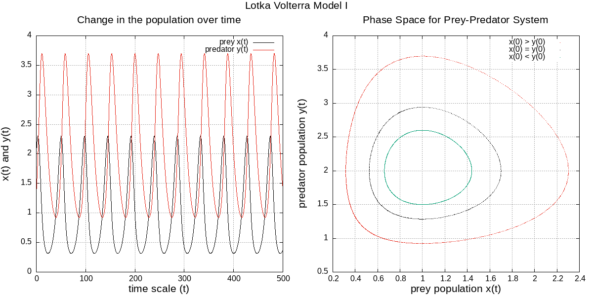
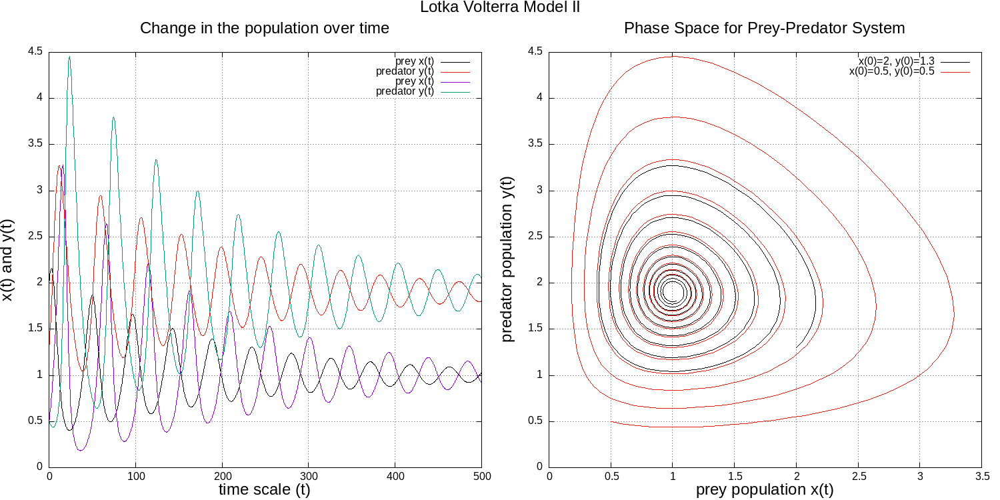
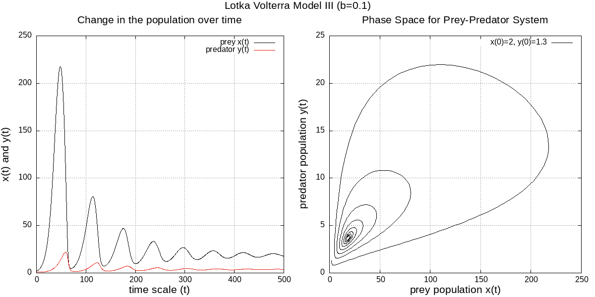
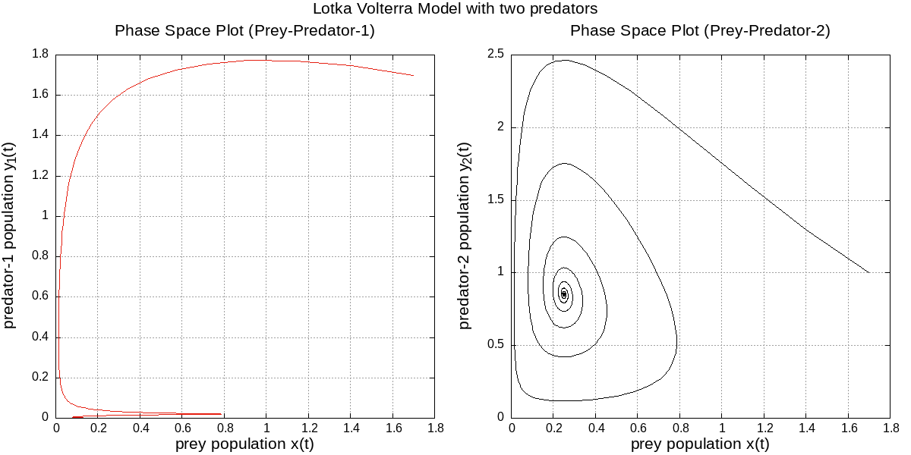

# Lotka Volterra Population Dynamics
## Advanced Numerical Techniques Project
**Problem:** Even in this complex behivour of nature we see in general there is a balance in everything around us (ignoring the human perturbation). Every species has it's own balance numbers since nature doesn't support the exponential growth of any species. We want to achieve this natural behiviour in our simulation. We'll start with an hypothetical sitution and step by step with the help of the following book we'll modify the assumptions untill we reach our interested situation. Our main interest will be the prey population where we'll use a small numbers of predators to control the population of prey so that the number of prey remains approximately constant.

Please read the report for better understanding of the topic.
## LVM I

## LVM II

## LVM III

## LVM IV

## Requirements
* Text Editor (Atom/Sublime...)
* GCC Compiler
* Gnuplot

## Contact
If you've any doubt or suggestions regarding the project, please feel free to reach out by filing an issue here on github or you can simply email me at [nirsingh124@gmail.com](mailto:nirsingh124@gmail.com). You can also drop a message to my [Telegram](https://t.me/singhnir) account.

## Acknowledgements

## Licence
[Apache-2.0 License](https://github.com/singhnir/lotka-volterra-model/blob/main/LICENSE)
